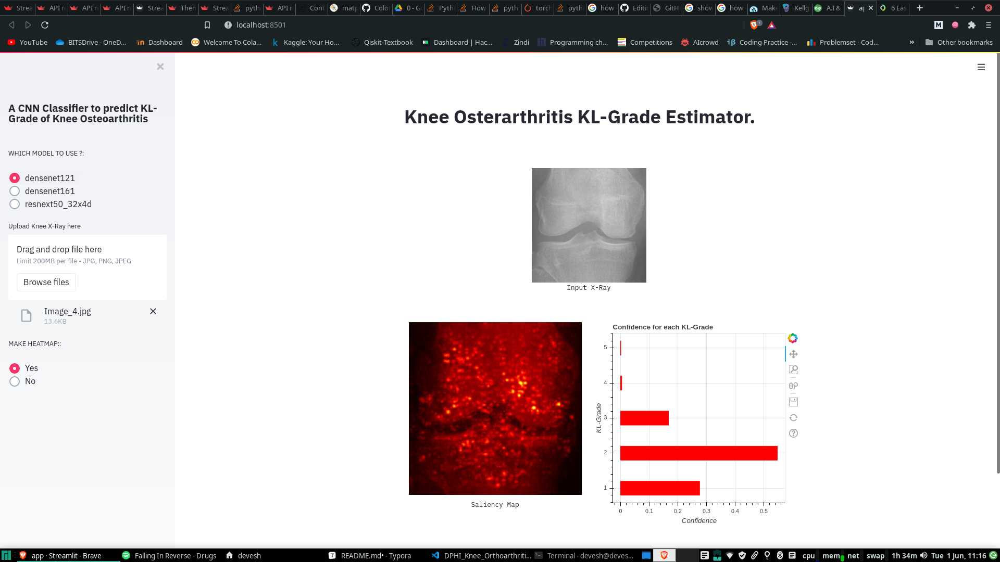
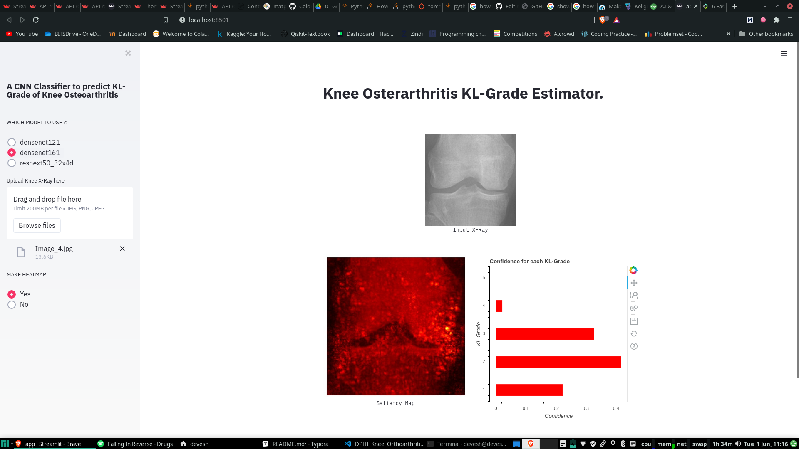
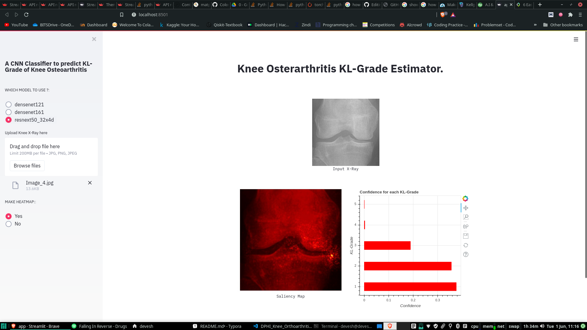
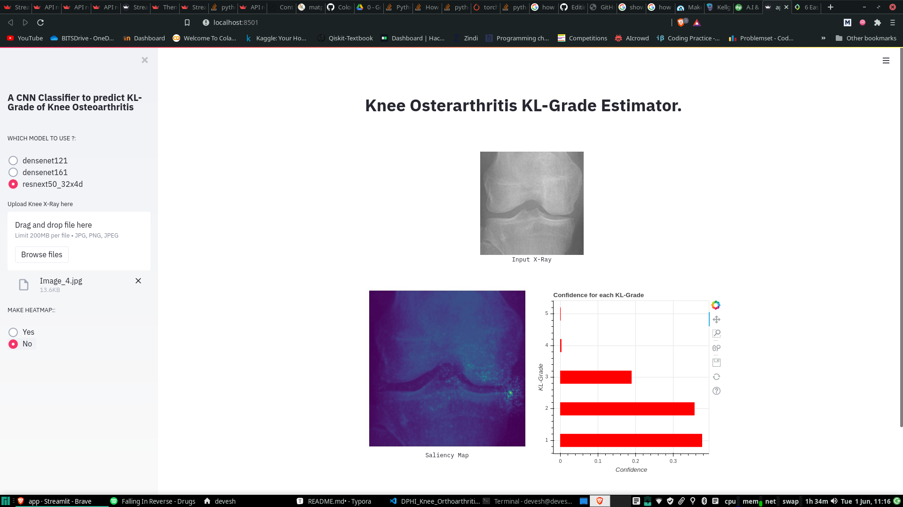

# Knee-Osteoarthritis KL-Grade Estimator

Knee osteoarthritis (OA), also known as degenerative joint disease, is typically the result of wear and tear and progressive loss of articular cartilage. It is typically a progressive disease that may eventually lead to disability. The intensity of the clinical symptoms may vary from each individual. However, they typically become more severe, more frequent, and more debilitating over time. The rate of progression also varies for each individual.

The **Kellgren and Lawrence system** is a common method of classifying the severity of osteoarthritis using five grades. 

- **grade 0 (none)**: definite absence of x-ray changes of osteoarthritis
- **grade 1 (doubtful)**: doubtful joint space narrowing and possible osteophytic lipping
- **grade 2 (minimal)**: definite osteophytes and possible joint space narrowing
- **grade 3 (moderate)**: moderate multiple osteophytes, definite narrowing of joint space and some sclerosis and possible deformity of bone ends
- **grade 4 (severe)**: large osteophytes, marked narrowing of joint space, severe sclerosis and definite deformity of bone ends.

## Dataset

The dataset used here was from [DPhi Knee-Osteoarthritis Detection Challenge]('https://dphi.tech/challenges/data-sprint-35-osteoarthritis-knee-x-ray/81/overview/about'), which contained x-rays for 5 KL-Grades with distribution as follows:

- **grade 0** - 3085 images
- **grade 1** - 1416 images
- **grade 2** - 2062 images
- **grade 3** - 1029 images
- **grade 4** - 236 images

## Methodology

1. **Preprocessing the X-ray** - to remove noise and make the x-rays more clear, a *Gausian Blur Kernal* of size 5 was applied followed by *Histogram Equilization*.
2. **Models** - Used 3 different architectures namely *Densenet121, Densenet161* and *Resnext50_32x4d*.
3. **Loss Function, Optimizer and Learning Rate** - *Binary Cross Entropy* and *AdamW* with weight decay set to 1e-3 and learning rate set to 1e-4
4. **Schedular** - *CosineAnnealingWarmRestarts* with T_0 = 5 and T_mult = 1 with minimum learning rate set to 1e-6
5. **Validation** - Stratified 5-fold validation. 

## Streamlit App

#### To run app on your local machine:

1. Make sure python==3.6 or above is installed.
2. download and unzip the repo.
3. open command line and change the directory to Knee-Osteoarthritis.
4. `pip install -r requirements.txt`
5. `streamlit run app.py`

#### Screenshots

